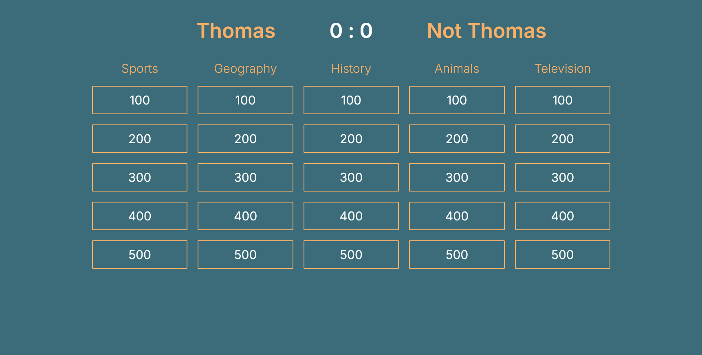

# GeoParTy

## Description
This is a web app that utilizes ChatGPT to play a fun quiz game with your friends!
Check it out at [geoparty.thomasherstad.dev](https://geoparty.thomasherstad.dev)!

## Motivation
Every year before Christmas, my best friends from back home and I have a Christmas party. A tradition that we built throughout the years was that each person had to "host" an activity for at least 10 minutes. Because of ChatGPT's popularity in 2023 I had the idea to use it as a quiz host to come up with questions in the style of Jeopardy. I sketched up a game board on Excalidraw, wrote some prompts for different situations and we played the game that evening. It was a lot of fun! Afterwards I thought it would be cool to make this into a proper website where you could play the game automatically after setting up the categories. You wouldn't even need anyone to host it so we could all play! I wrote down a list of features I wanted to include and set my target for the 2024-edition of the Christmas party. I had just started learning to code in Python and this felt like a gigantic task for me at the time, but look at it now!

This has been a great project for to learn more about how web apps work. Frontend, backend, API requests, http requests, sending json data and website hosting.

## Quick Start
Navigate to [geoparty.thomasherstad.dev](https://geoparty.thomasherstad.dev) to play the game! 

It is using my OpenAI API key which doesn't have much money on it. In case you want to clone the repo and host it with your own API key feel free to do so.

## Usage

## Contributing
